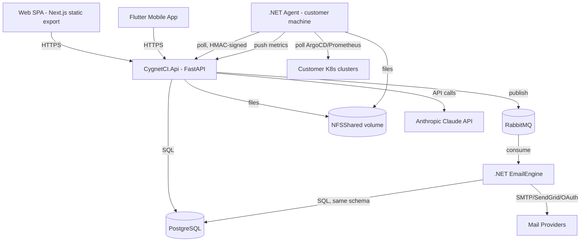
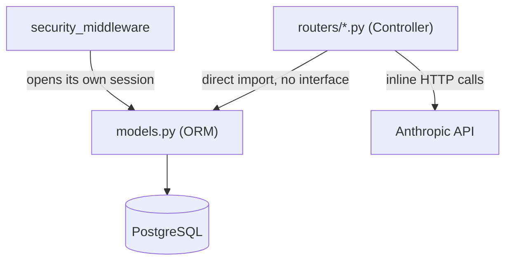
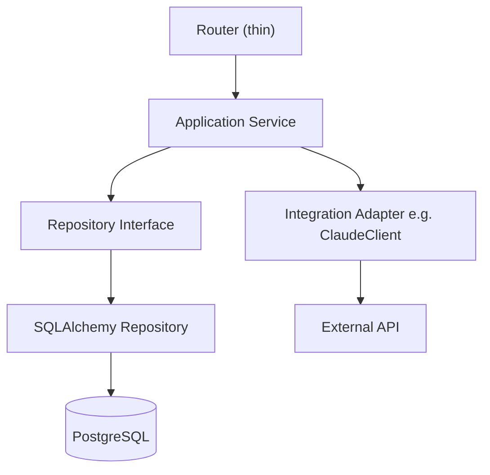
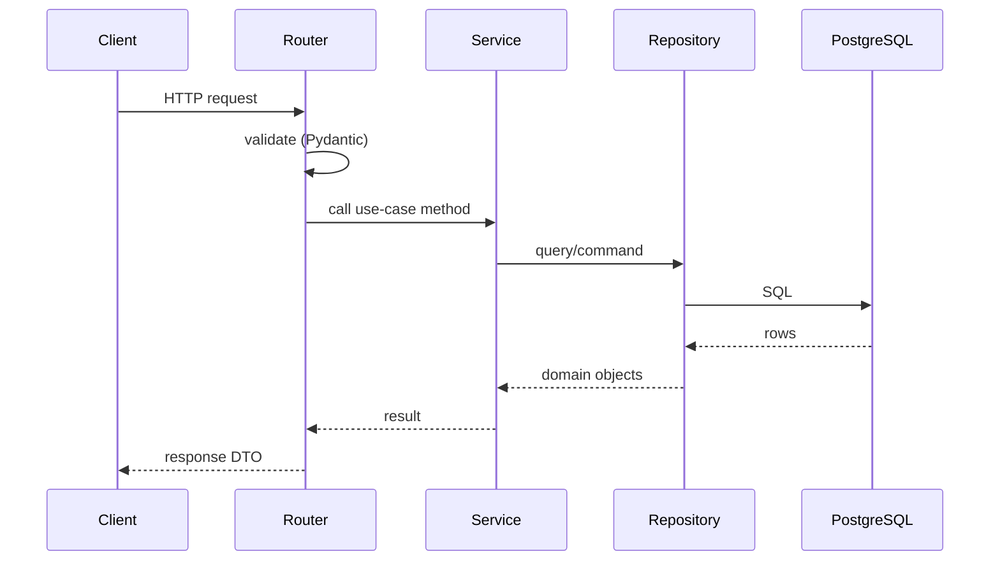
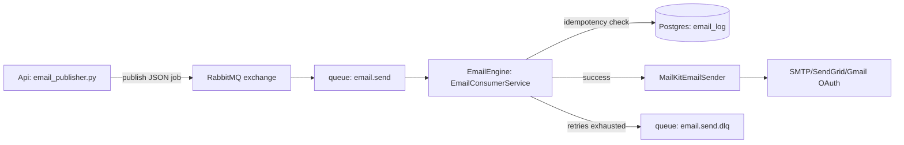
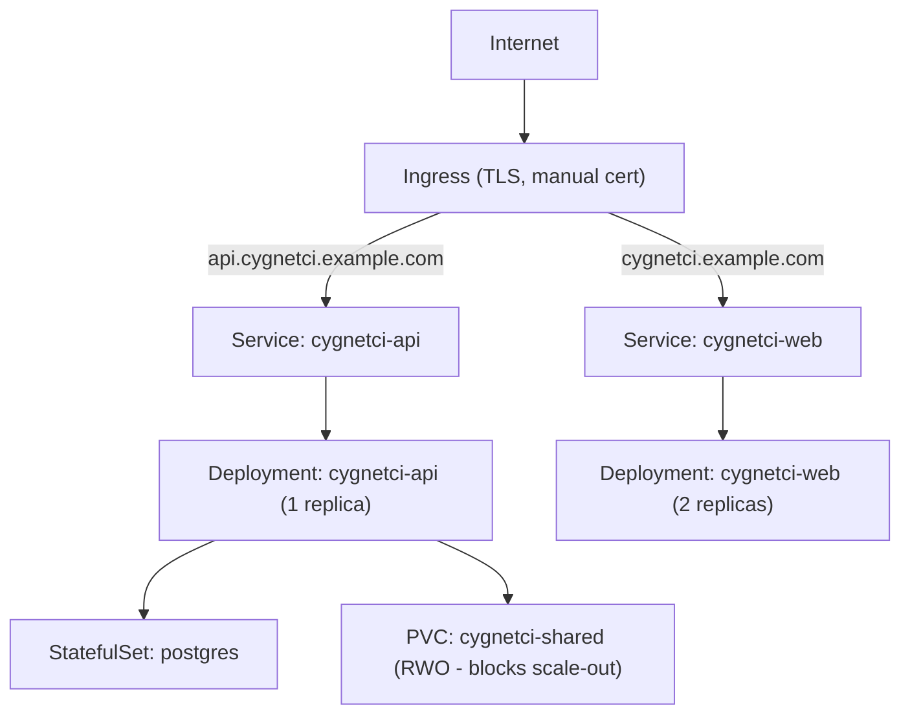

# CygnetCI — Architecture Assessment

> Prepared as a full-codebase architecture review (analysis only — no code was changed as part of this document). Covers all 8 codebases in the solution: **CygnetCI.Api** (Python/FastAPI), **CygnetCI.Web** (Next.js), **CygnetCI.Agent** + **CygnetCI.Agent.Installer** (.NET), **CygnetCI.EmailEngine** (.NET), **CygnetCI.MobileApp** (Flutter), **CygnetCI.Database** (raw SQL), plus `k8s/`, `deploy/`, `NFSShared/` infra.
>
> Every claim below is backed by a file:line citation gathered by directly reading the source — nothing here is inferred from names alone. `CygnetCI.ImportEngine` is an **empty folder** (no source files) — a placeholder for a module that hasn't been started.

---

## 1. Executive Summary

CygnetCI is an on-prem CI/CD orchestration platform: a central **Api** that customer-installed **Agents** poll for work (pipelines, releases, file transfers, ad hoc commands), a **Web** admin console, a Flutter **mobile monitoring app**, and a standalone **EmailEngine** worker for alert emails. It also embeds an AI ticket-assistant (Anthropic Claude) and ingests Kubernetes/ArgoCD/Prometheus metrics from customer clusters.

The system works and is clearly shipping (active commits, multiple deployment targets: Docker, K8s, IIS, bare-metal systemd). Architecturally it is a **classic layered/MVC-ish monolith on the backend** with **no enforced boundaries between HTTP, business rules, and persistence** — every router file talks to the ORM directly. The frontend has a similar shape: a partial API-client abstraction that roughly half the codebase bypasses. The two .NET services are the best-structured pieces of the whole solution (clean DI, `ILogger`, interface-based services).

The most urgent issues are not architectural elegance — they're **operational risk**: real production-looking passwords committed to `config.ini` and `k8s/01-postgres.yaml`/`02-api.yaml`, `print()`-based logging that dumps the full DB password to stdout on every boot, zero migration ledger (no way to know what's applied to a given database), and near-zero automated test coverage on the business logic that actually matters (release approval flow, pipeline execution, AI ticket tool-use).

**Recommendation: do not introduce microservices, Clean Architecture layers-as-projects, or CQRS.** This should remain a **modular monolith**, restructured along the business modules that already exist implicitly (Agents, Pipelines, Releases, Transfer/Rollback, Tickets, Email, Users/Auth, Customers). The highest-leverage work is (a) get secrets out of git and logs, (b) put a real migration tool in front of the 13 ad hoc SQL scripts, (c) extract a thin service layer under the biggest router files, (d) add tests around the release-approval and pipeline-execution logic before touching it further.

---

## 2. Current Project Structure

```text
CygnetCI/
├── CygnetCI.Api/            Python 3.11 FastAPI — central backend, single deployable
│   ├── main.py               app assembly + custom auth middleware (538 lines)
│   ├── models.py             54 SQLAlchemy ORM models (1180 lines)
│   ├── routers/               19 route modules, no service/repository layer
│   ├── deps.py, auth.py, database.py, config.py   cross-cutting
│   ├── email_service.py, email_publisher.py, claude_service.py   integrations
│   ├── ~15 run_*_migration.py / check_*.py / add_*.py / fix_*.py  ad hoc DB scripts
│   ├── migrations/            3 more loose .sql files, no runner found
│   └── tests/                 2 files, smoke-test only
├── CygnetCI.Web/cygnetci-web/  Next.js 16 static export SPA
│   └── src/{app,components,lib,types}   19 route folders, 20 files >400 lines
├── CygnetCI.Agent/            .NET 9 Worker Service — runs on customer machines
│   ├── AgentWorker.cs          orchestrates 7 polling sub-services
│   ├── Http/CygnetApiClient.cs the only HTTP client to the Api (685 lines)
│   └── Services/               7 interface-backed polling services
├── CygnetCI.Agent.Installer/  WiX v4 MSI installer for the Agent
├── CygnetCI.EmailEngine/      .NET 9 Worker Service — RabbitMQ email consumer
├── CygnetCI.ImportEngine/     EMPTY — no source files
├── CygnetCI.MobileApp/        Flutter — on-call monitoring + local alarm
├── CygnetCI.Database/         13 raw .sql files, no migration framework
├── CygnetCI.Docs/             Existing architecture/deployment docs
├── k8s/                       6 manifests: namespace, postgres, api, seed-job, web, ingress
├── deploy/                    systemd unit + nginx conf for bare-metal
├── NFSShared/                 shared volume: artifacts/, rollback/, scripts/
└── CygnetCI.sln                only Agent + EmailEngine are actually in the .sln
```

### Folder/Project Table

| Folder/Project | Responsibility | Dependencies | Problems | Recommendation |
|---|---|---|---|---|
| CygnetCI.Api/routers/*.py | HTTP + business rules + persistence, all in one | models.py, database.py | No service layer; `releases.py`, `tickets.py`, `pipelines.py`, `monitoring.py`, `transfer.py`, `email.py` are 500–1478 lines each | Extract a thin application-service layer per module (§8, §21) |
| CygnetCI.Api/models.py | All 54 ORM models in one file | database.py | 1180-line God file | Split by module (agents, pipelines, releases, tickets, …) |
| CygnetCI.Api top-level `run_*.py`/`add_*.py`/`fix_*.py` (~15 files) | One-off DB migration/fix scripts | psycopg2 or SQLAlchemy directly | Two inconsistent DB-connection patterns; some hardcode credentials (`run_migration.py:8-14`, `check_pickups.py:11`) independent of `config.ini` | Replace with a real migration tool (§10, §21) |
| CygnetCI.Web/src/lib/api/apiService.ts + scattered fetch | API access | `lib/config.ts`, `lib/apiClient.ts` | 154 raw `fetch(` call sites across 28+ files bypass `apiService`; auth injected via a global `window.fetch` monkey-patch (`apiClient.ts:57-79`) rather than by callers | Consolidate on one client; keep the interceptor but route everything through it explicitly |
| CygnetCI.Web/src/types/index.ts | Shared API types | — | 47 files define their own local duplicate interfaces instead of importing shared ones (e.g. `customers/page.tsx:7` duplicates `CustomerContext.tsx:7-20`) | Enforce shared types at PR review; no tooling needed |
| CygnetCI.Agent/Services/* | Polling workers, one per capability | Http/CygnetApiClient.cs | Well-structured — interface per service, DI-registered, `ILogger` throughout | Keep as-is; this is the pattern the rest of the solution should aspire to |
| CygnetCI.Agent.Installer/PublishFiles.wxs | Hardcoded file list for MSI | — | 1623 lines of hand/generated `<File>` entries with **absolute machine-specific paths** (`D:\Avesh\...`), overlapping with `Files.wxs`'s dynamic harvesting of the same directory | Delete `PublishFiles.wxs`, keep only the dynamic `Files.wxs` harvest (needs verification before removal — see §24) |
| CygnetCI.EmailEngine/Services/* | RabbitMQ consumer + SMTP/SendGrid/OAuth sender | Npgsql/Dapper direct to Postgres | Reads/writes the **same Postgres tables** as the Api directly (`SettingsRepository.cs:28-33` against `app_settings`/`email_templates`/`email_log`) — two independently-deployed codebases both owning the same schema with no contract between them | Acceptable for now (documented below, §7/§11) but the schema for these 3 tables becomes a de facto shared contract — changes must be coordinated manually |
| CygnetCI.MobileApp/lib/services/background_service.dart | Android background polling | own `Dio` instance | Duplicates the HTTP logic in `api_service.dart` because it runs in a separate isolate | Low priority — document why the duplication exists (already partly done in code) |
| CygnetCI.Database/*.sql | Schema definition | — | No migration ledger table anywhere (`schema_migrations`/`alembic_version` — zero matches); `roles` table is referenced by `003_add_user_roles.sql` but **never created** in any file read | Confirm `roles` table exists (maybe created directly by an app script not covered) before relying on it; introduce a migration ledger |
| k8s/*.yaml | K8s deployment | — | Plaintext passwords in `01-postgres.yaml:14`, `02-api.yaml:19/45/118/120`; unresolved `REGISTRY/...:latest` image refs; no resource requests/limits anywhere; API PVC is RWX-incompatible at >1 replica | Move secrets to a real secret manager or at minimum `kubectl create secret` outside git; pin image tags |
| CygnetCI.ImportEngine/ | Nothing — empty | — | Dead placeholder in the solution tree | Remove or document as "not yet started" so it isn't mistaken for a missing/broken module |

---

## 3. Technology Stack

| Layer | Technology | Evidence |
|---|---|---|
| Api language/framework | Python 3.11/3.12, FastAPI | `CygnetCI.Api/Dockerfile`, `main.py` |
| Api ORM | SQLAlchemy (Core+ORM), `create_engine` pooled | `database.py:13-20` |
| Api migrations | **Alembic declared in requirements.txt but never wired up** — zero references in code, no `alembic.ini`/`env.py`/`versions/` | confirmed by grep |
| Api DB driver | psycopg2-binary | `requirements.txt` |
| Api auth | Opaque bearer session tokens (SHA-256 hashed in DB), **not JWT**; bcrypt + legacy SHA-256 fallback | `auth.py:32-46`, `routers/auth.py:97-100` |
| Api messaging | RabbitMQ via `pika` (publish-only; consumer lives in EmailEngine) | `email_publisher.py` |
| Api AI integration | Anthropic Claude — 3 separate integration points (SDK + 2x raw httpx) | `claude_service.py`, `routers/tickets.py:757-794,964-989` |
| Api cache | None (Redis/etc.) — only in-process dict caches with TTL | `main.py:211-225`, `module_flags.py:53-78` |
| Api logging | **No structured logging** — `print()` almost everywhere; only `email_publisher.py` uses `logging` | confirmed by grep |
| Api testing | pytest, 2 files, integration-smoke style | `tests/conftest.py`, `tests/test_routers.py` |
| Web framework | Next.js 16 (App Router), static export (`output:'export'`) | `next.config.ts:3-19` |
| Web UI | React 19, Tailwind v4 (CSS-first, no config file) | `package.json`, `postcss.config.mjs` |
| Web state | Plain React state + 3 Contexts — **no Redux/Zustand/React Query/SWR** | confirmed absent in `package.json` |
| Web testing | **None** — no jest/vitest/playwright, no test files | confirmed absent |
| Web hosting | nginx serving static files | `nginx.conf`, `Dockerfile` |
| Agent runtime | .NET 9 Worker Service, dual Windows-Service/systemd host | `CygnetCI.Agent.csproj:1,4`, `Program.cs:131-135` |
| Agent HTTP | `HttpClient` + custom `DelegatingHandler`s for agent-UUID and HMAC auth | `Http/AgentUuidHeaderHandler.cs`, `Http/HmacCredentialHandler.cs` |
| Agent logging | `ILogger<T>` throughout, no Console.WriteLine, no Serilog | confirmed by grep |
| Agent installer | WiX Toolset v4 (MSI) | `.wixproj`, `.wxs` files |
| EmailEngine runtime | .NET 9 Worker Service, dual host | `CygnetCI.EmailEngine.csproj`, `Program.cs` |
| EmailEngine mail | MailKit (SMTP/SendGrid/Gmail-OAuth2) | `MailKitEmailSender.cs` |
| EmailEngine DB | Npgsql + Dapper, direct to the **same Postgres** the Api uses | `SettingsRepository.cs` |
| Mobile framework | Flutter, `provider` for state, `dio` for HTTP | `pubspec.yaml:9-21` |
| Mobile storage | `flutter_secure_storage` (token) + `shared_preferences` (base URL) | `secure_store.dart` |
| Mobile testing | **None** — the only test file is the unmodified `flutter create` counter-app template, doesn't even compile against the real app | `test/widget_test.dart` |
| Database | PostgreSQL, raw SQL DDL, no ORM-managed migrations | `CygnetCI.Database/*.sql` |
| Containerization | Docker (multi-stage + prebuilt-bundle variants for both Api and Web) | `Dockerfile*` files |
| Orchestration | Kubernetes manifests (plain YAML, no Helm/Kustomize) | `k8s/*.yaml` |
| Bare-metal deploy | systemd units + nginx reverse proxy | `deploy/*` |
| CI/CD | **Not identified in the repository** — no `.github/workflows`, no Jenkinsfile, no Azure Pipelines, no GitLab CI found |
| Secrets management | **Not identified** — no Vault/Sealed-Secrets/SOPS/cloud KMS; secrets are plaintext in `config.ini`, `appsettings.json`, and `k8s/*.yaml` |
| Observability/APM | **Not identified** — no OpenTelemetry, no Prometheus client on the Api side, no centralized log aggregation configured in-repo |
| Cloud services | **Not identified** — deployment targets are self-hosted (K8s, systemd, IIS), no AWS/Azure/GCP SDK usage found beyond the Agent's optional Prometheus/ArgoCD polling of customer clusters |

---

## 4. Current Architecture

**Classification: Layered/Transaction-Script monolith with a thin, informal MVC shape** — routers act as controllers, `models.py` is the (anemic) data model, there is no application/domain layer. This is not Clean/Hexagonal/Onion architecture despite superficial folder separation (`routers/` vs top-level modules) — dependency direction is not enforced and persistence leaks everywhere.

Is it used correctly for what it is? **Partially.** For a system this size, a layered monolith is the *right* choice — the problem isn't the paradigm, it's that there's no actual layering, just files organized by HTTP route.

**Where it violates architectural principles:**
- Controllers (`routers/*.py`) contain business rules directly — e.g. `routers/releases.py:554-675` (`deploy_release`) does permission checks, release-numbering logic, an approval-requirement decision tree, and ORM writes all in one 120-line function with no service-layer seam to unit-test any of it independently of FastAPI/DB.
- Persistence is not behind an interface anywhere — every router imports `models` and calls `db.query(...)` directly (43 occurrences in `pipelines.py` alone). There is no repository abstraction, so business rules and SQLAlchemy specifics are inseparable.
- Two different Anthropic API client implementations exist for the same external service (`claude_service.py`'s SDK wrapper vs. two raw httpx calls in `tickets.py`) — no adapter/port boundary for this integration.
- The security/auth middleware (`main.py:290-409`) opens its own DB sessions directly rather than going through `Depends(get_db)`, so the request pipeline has two different session-lifecycle patterns.

**What architecture should be used going forward:** Stay a **modular monolith**, organized by business module (Agents, Pipelines, Releases, Transfer/Rollback, Tickets, Email, Users/Auth, Customers) each with a thin `router → service → repository` chain inside it. **Do not** move to Clean Architecture's four-project-per-module ceremony, and **do not** split into microservices — there is one team, one deployable that already works, one database, and the traffic/scale profile (polling agents + an admin SPA) does not justify the operational cost of service boundaries. Explicitly: **remain a modular monolith.**

**The two .NET services (Agent, EmailEngine) already demonstrate the target shape** — interface-per-capability, DI-registered, no business logic in `Program.cs`. The Api should move toward that same discipline, just inside one Python process instead of splitting into more services.

---

## 5. Dependency Analysis

**Current (Api):**
```text
HTTP Request
   ↓
routers/*.py  ──────────────┐
   ↓ (direct import)         │ (direct import, no interface)
models.py (SQLAlchemy ORM)   │
   ↓                         │
database.py (engine/session) │
                              ↓
                   external integrations called
                   directly from router functions
                   (claude_service / raw httpx / pika)
```

**Incorrect dependencies found:**
```text
Controller → Database        routers/*.py call db.query(models.X) directly, no repository interface
Controller → External API    routers/tickets.py builds Anthropic HTTP payloads inline (lines 757-794, 964-989)
Middleware → Database         main.py:311-325 opens SessionLocal() directly, bypassing Depends(get_db)
```

**Recommended direction** (unchanged from the standard principle, adapted to Python/FastAPI — no need for physical "Domain/Infrastructure" projects, just enforced import discipline within one codebase):
```text
API (routers)          — HTTP concerns only: parse request, call service, shape response
   ↓
Application (services)  — business rules, orchestration, no FastAPI/SQLAlchemy imports
   ↓
Domain (optional, thin) — pure business rules if/when they get complex enough to warrant it
   ↓
Infrastructure (repositories, integrations) — SQLAlchemy, httpx, pika, Anthropic SDK live here only
   ↓
Database / External Systems
```

Outer layers depend on inner layers; a `service` function should be testable by passing it a fake repository, with zero FastAPI or SQLAlchemy imports in its file.

**Cross-service dependency (system-wide):**
```text
Web (SPA) ──HTTP──> Api ──poll (inbound)── Agent (customer machine)
                      │
                      ├──publish──> RabbitMQ ──consume──> EmailEngine ──direct SQL──> Postgres (same DB as Api)
                      │
                      └──direct SQL──> Postgres
MobileApp ──HTTP──> Api
Agent ──poll (ArgoCD/Prometheus)──> customer K8s clusters
```
The Api↔EmailEngine relationship is the one true cross-process coupling risk: they share a database schema with no contract layer (§7/§11) — a column rename in `app_settings`/`email_templates`/`email_log` breaks EmailEngine silently since nothing type-checks across the process boundary.

---

## 6. Business Module Analysis

| Module | Responsibility | Public Interface | DB Ownership | External Deps | Depends On | Should Depend On | Problem |
|---|---|---|---|---|---|---|---|
| Auth | Login/session/permissions | `/auth/*` | `users`, `user_sessions`, `password_reset_tokens` | email_publisher (password reset) | — | — | Dual password-hash schemes (bcrypt + legacy SHA-256) coexist indefinitely (`routers/auth.py:97-100`) |
| Customers | Multi-tenant org management | `/customers/*` | `customers`, `user_customers` | — | Auth (row-level filtering via `deps.py:64-85`) | Auth | None major |
| Agents | Agent registration/heartbeat/status | `/agents/*` | `agents`, `agent_resource_data`, `agent_logs` | inbound from .NET Agent | Customers | Customers | None major |
| Pipelines | CI pipeline CRUD + execution + pickup queue | `/pipelines/*` | `pipelines`, `pipeline_executions`, `pipeline_pickup`, `pipeline_steps` | Agents (pickup queue) | Agents, Customers | Agents, Customers | Business logic embedded in route handlers (758-line file) |
| Releases | Multi-stage release/deploy with approvals | `/releases/*` | `environments`, `releases`, `release_stages`, `release_executions`, `stage_executions`, `release_pickup` | Agents (pickup queue), Pipelines (can be pipeline-based) | Pipelines, Agents | Pipelines, Agents | Largest God file (1478 lines); approval decision-tree logic has zero test coverage |
| Transfer/Rollback | File distribution + rollback snapshots via NFS | `/transfer/*`, `/rollback/*` | `transfer_files`, `transfer_file_pickup` | NFSShared filesystem, Agents | Agents | Agents | Filesystem-path business logic mixed into route handlers (530-line file) |
| Tickets | Support tickets + AI assistant | `/tickets/*` | tickets-related tables (not enumerated in this pass) | Anthropic Claude API (direct httpx, 2 call sites) | — | Should go through `claude_service.py`'s adapter instead of ad hoc httpx | Largest single file (1029 lines); two different Claude client implementations in the codebase |
| Monitoring | Agent/service/K8s/ArgoCD/Prometheus metrics ingestion | `/monitoring/*`, `/k8s/*` | in-memory stores + some DB tables | inbound push from Agent (Agent polls ArgoCD/Prometheus, pushes results here) | Agents | Agents | 505–530-line files; in-memory `_service_log_content_store`/`_k8s_metrics_store` are not persisted, lost on restart/across replicas |
| Email | SMTP/template config + alert delivery | `/email/*` | `app_settings`, `email_templates`, `email_log` | RabbitMQ (publish), **EmailEngine (separate process, shared DB)** | — | — | Shared-DB coupling with EmailEngine (§7) |
| Users/Roles | RBAC | `/users/*`, `/roles/*` | `users`, `roles`(?), `user_roles` | Auth | Auth | Auth | `roles` table referenced by `003_add_user_roles.sql`'s FK but its `CREATE TABLE` was not found in any of the 13 SQL files read — **verify this before relying on it** (§24) |
| Modules (feature flags) | Deployment-level module enable/disable | `/modules/*` | `SystemModule` (referenced from Python, not confirmed in raw SQL pass) | — | — | — | None major |

No circular module dependencies were found. The dependency direction (Auth ← everything, Agents ← Pipelines/Releases/Transfer/Monitoring) is logically sound; the problem is purely internal (module → DB directly, no seam), not module-to-module coupling.

---

## 7. Domain Layer

**Domain logic that should be framework/DB-independent but currently is embedded in FastAPI route handlers:**
- Release approval decision tree (`routers/releases.py:634-640`) — whether a stage requires approval, initial status computation.
- Release-number generation (`routers/releases.py:592`, string formatting business rule).
- Module-path-to-feature-flag resolution (`module_flags.py:19-50`) — this one is already reasonably isolated, a good template to copy.
- Permission-shape normalization merging two role-permission JSON formats (`auth.py:84-99`) — already isolated in the shared `auth.py`, another good template.
- Agent offline-detection threshold (`main.py:464-499`, 2-minute staleness rule) — currently inline in the background task, should be a named domain rule.

**Application logic (use-case orchestration)** — currently indistinguishable from domain logic because both live in the same router functions:
```text
CreateRelease / DeployRelease   → routers/releases.py
ExecutePipeline                 → routers/pipelines.py
ExecuteAgentCommand              → routers/agent_exec.py (Api side) + CommandExecutionService.cs (Agent side)
TransferFile / RollbackTenant   → routers/transfer.py, routers/rollback.py
ProcessTicketWithAI             → routers/tickets.py:964-989
SendAlertEmail                  → email_publisher.py (Api) → EmailConsumerService.cs (EmailEngine)
```

**Infrastructure logic** (correctly identifiable, needs to move behind interfaces):
```text
PostgreSQL           → database.py, models.py (SQLAlchemy)
RabbitMQ             → email_publisher.py (Api, publish), EmailConsumerService.cs (EmailEngine, consume)
Anthropic Claude      → claude_service.py + 2x raw httpx in tickets.py (should consolidate to one adapter)
SMTP/SendGrid/OAuth   → MailKitEmailSender.cs (EmailEngine)
NFS filesystem         → config.py's get_nfs_shared_root()/get_scripts_folder()/get_artifacts_folder()
Kubernetes/ArgoCD/Prometheus → ArgocdService.cs, PrometheusService.cs (Agent side, well isolated already)
```

The .NET Agent already separates these correctly (`Services/ArgocdService.cs`, `Services/PrometheusService.cs` behind `IArgocdService`, hosted-service registration). The Api needs the equivalent discipline.

---

## 8. API Design

Current flow (Api):
```text
HTTP Request → security_middleware (auth+module-gate) → router function
   → [permission check, ORM query, business rule, ORM write, response shape — all inline]
   → HTTPException on error, JSON response
```
No request validation layer beyond Pydantic models at the FastAPI boundary (which is fine and idiomatic) — the gap is entirely between "validated request" and "database," where nothing separates orchestration from persistence.

**Recommended flow** (same physical files, just enforced separation):
```text
HTTP Request
   ↓
Router (Controller) — thin: parse/validate request, call one service method, map result to response model
   ↓
Application Service — orchestration + business rules (no FastAPI, no SQLAlchemy imports)
   ↓
Repository interface — e.g. ReleaseRepository.get_pending(customer_id)
   ↓
SQLAlchemy repository implementation
   ↓
PostgreSQL
```
Controllers should shrink from the current 100+ line handlers (e.g. `deploy_release`) down to ~10-15 lines each.

---

## 9. Database Architecture

- **ORM**: SQLAlchemy, declarative models, connection pool `pool_size=20, max_overflow=40, pool_recycle=1800, pool_pre_ping=True` (`database.py:13-20`) — reasonable defaults for a single-node Postgres.
- **Transactions**: single `db.commit()` at the end of each route handler is the pattern (e.g. `releases.py:668`) — no explicit transaction boundary abstraction, relies on SQLAlchemy's implicit session-scoped transaction. Fine for current complexity, but the release-deploy flow does multiple related writes (ReleaseExecution + StageExecution + ReleasePickup) with no rollback test coverage if one insert fails mid-function.
- **Concurrency risk**: `models.Base.metadata.create_all(bind=engine)` runs on **every process boot** (`main.py:47`) — with 2+ API replicas (as `k8s/02-api.yaml` implies is the scaling plan) starting simultaneously, this is a benign no-op for existing tables but is still schema-drift-prone since it silently creates missing tables/columns without any change review.
- **Migration strategy — the single biggest structural gap**: 13 raw `.sql` files with **no migration ledger table** (confirmed absent by grep across all files) plus ~15 Python runner scripts using two inconsistent connection patterns (hardcoded credentials in some, `config.ini`-driven in others). There is no way to answer "has script X already run against this database" except by inspecting the schema by hand. `alembic` is a declared dependency that is completely unused.
- **Missing table risk**: `003_add_user_roles.sql` creates `user_roles` referencing `roles(id)`, but no `CREATE TABLE roles` was found in any of the 13 files read in this pass — this needs to be confirmed as either created elsewhere (e.g. by an app-level script not in `CygnetCI.Database/`) or as a real bug, **before any migration-tooling work starts** (§24, treat as a verification task, not an assumption).
- **Performance**: 21 indexes exist in `db_schema.sql` covering status/timestamp columns — reasonable baseline; no evidence of missing indexes was specifically investigated (out of scope for this pass without query-log data).

---

## 10. External Integration Architecture

| Integration | Current Shape | Problem |
|---|---|---|
| Anthropic Claude | 3 separate call sites: `claude_service.py`'s SDK wrapper, plus 2 raw `httpx` calls in `routers/tickets.py:757-794,964-989` | No single adapter/port — API version, headers, and error handling are duplicated and could drift |
| RabbitMQ | Clean publish/consume split across two processes (Api publishes, EmailEngine consumes), topology matches on both sides | This one is actually a **good example** of an adapter boundary — publisher never touches send logic |
| SMTP/SendGrid/Gmail-OAuth | Isolated in `MailKitEmailSender.cs` behind `IEmailSender` | Good — the EmailEngine's DI-based structure is the template to copy elsewhere |
| ArgoCD / Prometheus | Isolated behind `IArgocdService`, conditionally registered per-cluster config | Good — same praise as above |
| Kubernetes (Api side) | `routers/k8s.py` is a **passive ingestion endpoint** (no K8s client library) — Agent does the actual cluster polling and pushes results in | Consistent with the "Api never reaches into customer infra directly" security posture — correct design choice, not a problem |

**Recommendation**: consolidate the two Anthropic call sites in `tickets.py` to go through `claude_service.py`'s SDK client (or promote a shared `ClaudeClient` used by both), so there's exactly one adapter for this external dependency.

---

## 11. Error Handling

**Current state**: no custom exception hierarchy anywhere in Python application code (confirmed by grep — only vendored packages define exception classes), no `app.exception_handler` registered. Every error path is `raise HTTPException(status_code=..., detail=...)` inline, 434 occurrences across the codebase. On the .NET side, both services use conventional try/catch with `ILogger` — reasonable, no anti-pattern found there.

**Recommended consistent scheme (Api)**:
```text
DomainError (business rule violation)       → 422/400
ValidationError (Pydantic, already handled by FastAPI) → 422
AuthenticationError                          → 401
AuthorizationError (permission/module gate)  → 403
NotFoundError                                → 404
ExternalIntegrationError (Claude/SMTP/RabbitMQ down) → 502/503, generic message to client
UnexpectedError                              → 500, generic message + correlation ID logged server-side
```
Add one `@app.exception_handler` per category at `main.py`, mapping domain exceptions to HTTP status — this alone would let route handlers `raise ReleaseNotApprovable(...)` instead of constructing `HTTPException` with hand-written strings 434 times.

**Never expose**: raw stack traces or SQLAlchemy error text to the client (spot-check needed — not explicitly verified whether any `except Exception as e: raise HTTPException(detail=str(e))` pattern leaks internals; recommend auditing this specifically in Phase 7, §24).

---

## 12. Logging & Observability

**Critical finding**: `config.py:181`'s `print_config()`, called unconditionally at `main.py:80` on **every single process boot**, prints the full Postgres connection URL **including the plaintext password** to stdout. In a containerized/K8s deployment this lands directly in `kubectl logs` / whatever log aggregator is attached.

**Current state**:
- No `logging.basicConfig()` anywhere in the Api; only `email_publisher.py` uses the `logging` module properly.
- Everything else uses bare `print()` — no log levels, no structured fields, no way to filter by severity in production.
- No correlation/request ID generation anywhere in the Api.
- `.NET` services are the good example: `ILogger<T>` throughout, structured args (e.g. `AgentWorker.cs:110-112` logs `{Attempt}`, `{Delay}` as structured fields, not string-interpolated).

**Recommended for the Api** (minimal, no new infra required):
- Replace `print()` with Python's `logging` module, configured once in `main.py` at startup (JSON or key=value formatter).
- Add a request-ID middleware (generate/propagate `X-Request-ID`, log it on every line for that request) — cheap, high value, matches what the .NET side would need if it ever calls the Api and wants trace correlation.
- Remove `print_config()`'s password printing immediately — this is a live credential leak, not a style issue.
- Health checks already exist (`/monitoring/api/ping`, referenced by `k8s/02-api.yaml:94-101` and the Agent's `WebsitePings` feature) — good, keep them, but they're liveness-only; no readiness check that verifies DB connectivity was found.

**Never log**: passwords, tokens, API keys, encryption keys, PII — the audit found one existing violation (`config.py:181`) and no others in the sampled files; `claude_service.py` explicitly avoids logging its API key (comment at lines 96, 172-173), showing the team already knows the rule, it just wasn't applied consistently.

---

## 13. Configuration & Secrets

**This is the highest-severity finding in the entire assessment.** Real-looking credentials are committed to git in multiple places:

| Location | Secret | Severity |
|---|---|---|
| `CygnetCI.Api/config.ini` (tracked in git) | Postgres username/password for a network-reachable host, plus RabbitMQ password — **values redacted from this document; see the file itself** | Critical |
| `CygnetCI.Api/run_migration.py:8-14`, `check_pickups.py:11` (now fixed — see Phase 0) | Hardcoded DB password, different DB user than config.ini | Critical (also inconsistent with config.ini — suggests drift) |
| `k8s/01-postgres.yaml:14` | `POSTGRES_PASSWORD` in plaintext `Secret.stringData` — now an obvious `CHANGE_ME_...` placeholder (Phase 0), still must be replaced with a real generated secret before applying | Critical |
| `k8s/02-api.yaml:19,45,118,120` | DB password duplicated, Anthropic API key placeholder, `EMAIL_ENCRYPTION_KEY` placeholder, `ADMIN_PASSWORD` placeholder | Critical (even placeholders being in git normalizes the pattern — someone will paste a real key over the placeholder and commit it) |
| `deploy/cygnetci-api.service:14` | `EMAIL_ENCRYPTION_KEY=change-me-to-a-32-byte-random-string` directly in the systemd unit | High |

None of these are behind a secrets manager (Vault, Sealed Secrets, SOPS, cloud KMS, or even `.gitignore`'d env files pulled from CI) — **not identified in the repository**.

**Recommended separation**:
```text
Application Configuration   → config.ini structure/keys, appsettings.json structure (commit these, no values)
Environment Configuration   → per-environment values (dev/test/staging/prod), env vars or mounted config
Secrets Management          → pulled from a vault/secret store at deploy time, never committed
```
Concretely: remove `config.ini` and `.env` from git tracking (replace with the `.template` pattern that's referenced in comments but doesn't actually exist for `config.ini` — only `.env.example`-style templates should be committed), rotate every credential listed above (they must be considered compromised since they're in git history), and for K8s use `kubectl create secret` imperatively or an external-secrets operator instead of committing `Secret.stringData`.

---

## 14. Security Architecture

- **Authentication**: opaque server-side session tokens (SHA-256 hashed at rest), 7-day TTL, no JWT — this is a legitimate, simpler-than-JWT choice for a system where the Api is the only token issuer/validator (no need for stateless verification across services). Reasonable.
- **Password hashing**: bcrypt is correct; the **legacy SHA-256 fallback still being accepted at login** (`routers/auth.py:97-100`) means any account still on the old hash is protected by a much weaker scheme indefinitely — this should have a forced-migration path (rehash to bcrypt on next successful login, which may already be happening — not confirmed in this pass) and an eventual removal date.
- **Brute-force protection**: in-memory lockout (5 attempts/5-min window) exists (`routers/auth.py:36-63`) — good, but **in-memory means it resets on every restart and doesn't work across multiple API replicas** (each replica has its own counter) — a real problem once `k8s/02-api.yaml` scales beyond 1 replica.
- **Agent authentication**: IP allowlist + HMAC-SHA256 request signing (`main.py:341-407`, `Http/HmacCredentialHandler.cs`) with clock-sync correction (`ServerClockSync.cs`) — solid design for machine-to-machine auth.
- **Authorization**: permission model is resource/action-based (`auth.py:84-99`, `deps.py:42-53`), plus row-level customer-scoping (`deps.py:64-85`) — reasonable RBAC + multi-tenant row filtering.
- **Frontend authorization is UI-only** — `src/lib/permissions.ts:3` explicitly documents this ("server-side enforcement is authoritative"), which is the correct posture as long as every sensitive endpoint actually re-checks permissions server-side (spot-checked routers do call `require_permission`/`require_customer_access` deps — good).
- **Secrets in code/config**: covered exhaustively in §13 — this is the top security finding.
- **SQL injection**: no raw string-interpolated SQL was found in the router files sampled (ORM-only); the migration scripts execute whole `.sql` files via `cursor.execute(sql_script)`, not user input, so injection risk there is low, but worth confirming no user-supplied values ever reach `text()` calls unparameterized (not exhaustively checked across all 19 routers in this pass).
- **Dependency vulnerabilities**: not scanned in this pass — recommend running `pip-audit`/`npm audit`/`dotnet list package --vulnerable` as a Phase 7 action item (§24).

---

## 15. Background Processing / Async

Two genuinely separate async systems exist:

**1. In-process asyncio task (Api)** — `_agent_status_checker` (`main.py:464-499`): single infinite loop, `asyncio.sleep(60)`, marks agents offline after 2 min staleness. No retry/DLQ concept needed here (it's a monitor, not a job queue), but it does swallow all exceptions broadly (`main.py:497-499`) — acceptable for a heartbeat-style loop.

**2. RabbitMQ email pipeline (Api → EmailEngine)**:
```text
Api (email_publisher.py)  → publish JSON job → RabbitMQ exchange `cygnetci.email` / queue `email.send`
                                                        ↓
                                          EmailEngine (EmailConsumerService.cs) consumes
                                                        ↓
                                    idempotency check (email_log.idempotency_key)
                                                        ↓
                                    retry in-process up to MaxRetries, linear backoff (2×attempt sec)
                                                        ↓
                                    on exhaustion → nack, no requeue → DLQ (email.send.dlq)
                                                        ↓
                                    failure logged to Postgres email_log
```
This is a **solid, production-appropriate design** already: idempotency key with a partial-unique-index upsert (`SettingsRepository.cs`'s `ON CONFLICT ... WHERE idempotency_key IS NOT NULL`), proper DLQ, permanent-vs-transient exception distinction (`PermanentEmailException` skips retries). The one weakness: retry backoff uses a **blocking `Thread.Sleep`** inside the RabbitMQ event handler (`EmailConsumerService.cs:135`), which stalls that consumer thread — with `PrefetchCount` > 1 this could still process other messages concurrently, but worth confirming prefetch is set high enough that one slow retry doesn't starve the queue.

**3. Agent-side polling** — 7 independent `PeriodicTimer` loops (heartbeat, tasks, files, releases, pipelines, monitoring, commands) is effectively a pull-based background-job system with no central queue — each interval is independently configurable (`appsettings.json`), and each has its own exception handling per poll cycle. This is a reasonable architecture for an agent that must work behind restrictive customer firewalls (poll-out only, no inbound webhook needed).

---

## 16. Testing Strategy — Current Coverage

| Codebase | Test Files | Framework | Coverage Character |
|---|---|---|---|
| CygnetCI.Api | 2 (`tests/`) + 1 stray script at repo root | pytest | Smoke-test only: one GET per router, route-count sanity check, 5 auth-required checks. **Zero tests for release approval logic, pipeline execution, AI ticket tool-use, or any POST/PUT/DELETE business rule.** |
| CygnetCI.Web | 0 | none | No framework installed at all |
| CygnetCI.Agent | not assessed in this pass (no test project referenced in .sln) | — | — |
| CygnetCI.EmailEngine | not assessed in this pass (no test project referenced in .sln) | — | — |
| CygnetCI.MobileApp | 1 (stale) | flutter_test | The one file is the **default counter-app template**, doesn't reference the app's actual root widget — effectively 0% coverage |

**Recommended priority order** (business-critical first, matching §6's module list): Release approval/deploy flow → Pipeline execution → Auth/permission logic → AI ticket tool-use loop → everything else. Given current near-zero coverage, the pragmatic move is **characterization tests before any refactor** (§24) — lock in current behavior with tests, then refactor underneath them.

---

## 17. Deployment Architecture

Three parallel deployment paths already exist for the Api+Web pair, which is more than most teams need but each serves a real customer scenario found in the docs:
```text
Internet
   ↓
[Path A: K8s] Ingress (05-ingress.yaml, TLS via manually-provided secret) → Service → Deployment (api/web)
[Path B: bare-metal] nginx (deploy/cygnetci.nginx.conf, HTTP only, no TLS in-repo) → systemd unit (127.0.0.1:8000)
[Path C: Docker Compose-less] standalone containers built from the Dockerfiles (multi-stage or prebuilt-bundle)
   ↓                              ↓
CygnetCI.Api                 CygnetCI.Web (static, nginx)
   ↓
PostgreSQL (StatefulSet in K8s, or external in bare-metal), RabbitMQ, NFSShared volume
   ↓
EmailEngine (separate systemd unit / container, direct DB access)
```
**Gaps**: no TLS termination configured anywhere in-repo for the bare-metal nginx path (K8s path has a TLS block but depends on an externally-provisioned cert since cert-manager annotation is commented out); no resource requests/limits on any K8s workload (risk: one runaway pod can starve the node); API's shared PVC is `ReadWriteOnce`, which the manifest's own comment (`02-api.yaml:51-52`) flags as incompatible with the >1 replica the Deployment presumably wants to scale to eventually.

---

## 18. Production Readiness Checklist

| Area | Status | Severity |
|---|---|---|
| Secrets in git (config.ini, k8s manifests, systemd unit) | Present, real-looking values committed | **Critical** |
| DB password printed to stdout on boot | Present (`config.py:181`) | **Critical** |
| No migration ledger / unclear which SQL scripts have run | Present | **Critical** |
| `roles` table referenced but not found created anywhere read | Needs verification | **High** (pending confirmation) |
| Brute-force lockout is in-memory (breaks across replicas/restarts) | Present | **High** |
| Legacy SHA-256 password fallback still accepted | Present | **High** |
| Zero business-logic test coverage (release approval, pipeline exec) | Present | **High** |
| No structured logging / no request correlation IDs (Api) | Present | **High** |
| No CI/CD pipeline found | Present | **High** |
| K8s workloads have no resource requests/limits | Present | **Medium** |
| K8s API PVC is RWO, blocks horizontal scaling | Present | **Medium** |
| No TLS in bare-metal nginx config | Present | **Medium** |
| Two Anthropic API client implementations (duplication, not a defect) | Present | **Low** |
| `CygnetCI.ImportEngine` empty placeholder in solution | Present | **Low** |
| WiX installer has duplicate/hardcoded-path file list (`PublishFiles.wxs`) | Present | **Low** |
| Mobile app release APK signed with debug keystore | Present | **High** (blocks legitimate production distribution) |
| No dependency vulnerability scanning found | Not identified | **Medium** |
| Health checks (liveness) exist; readiness (DB check) unclear | Partial | **Medium** |

---

## 19. Anti-Patterns Identified

**Fat controllers / business logic in route handlers** — `routers/releases.py:554-675`. *Impact*: can't unit-test the approval decision tree without a live DB and HTTP layer. *Fix*: extract to `ReleaseService.deploy()`.

**God files** — `models.py` (1180 lines, 54 models), `routers/releases.py` (1478), `routers/tickets.py` (1029). *Impact*: high merge-conflict rate, hard to navigate, hard to review changes safely. *Fix*: split by module.

**Duplicate external-API clients** — Anthropic called 3 different ways (`claude_service.py` + 2x raw httpx in `tickets.py`). *Impact*: divergent error handling, harder to change API version in one place. *Fix*: one `ClaudeClient` adapter.

**Inconsistent DB-credential sourcing in scripts** — some `run_*.py` hardcode credentials independently of `config.ini` (`run_migration.py:8-14`). *Impact*: credentials drift silently; rotating the real password doesn't fix these scripts. *Fix*: every script reads from `app_config`.

**Global fetch monkey-patching for auth (Web)** — `apiClient.ts:57-79` rewrites `window.fetch`. *Impact*: implicit, hard-to-trace auth injection; works today but is fragile (any future code using a raw `XMLHttpRequest` or a third-party SDK that does its own fetch silently loses auth, as already had to be worked around once for file uploads, `apiService.ts:536-540`). *Fix*: not urgent since it works, but new code should call a named `apiFetch()` explicitly rather than relying on the global patch.

**Duplicated local TypeScript interfaces** — 47 files redefine types that exist in `src/types/index.ts` (e.g. `customers/page.tsx:7` vs `CustomerContext.tsx:7-20`). *Impact*: types silently diverge over time. *Fix*: lint rule or code-review discipline, not a big rewrite.

**Hardcoded absolute paths in a checked-in installer file** — `PublishFiles.wxs` (1623 lines, paths like `D:\Avesh\CygnetCI\...`). *Impact*: this file cannot work correctly on any other machine; it appears to duplicate `Files.wxs`'s dynamic harvesting. *Fix*: verify it's actually referenced by `Package.wxs`/`.wixproj` before touching it — if unreferenced, delete; if referenced, replace with the dynamic harvest pattern already used in `Files.wxs`.

**Debug-signed mobile release build** — `android/app/build.gradle.kts:30-34` has a literal `// TODO: Add your own signing config` and ships release builds signed with the debug key. *Impact*: cannot be published to Play Store as-is; also a supply-chain concern if this APK is distributed directly. *Fix*: add a real release signing config before any production distribution.

**Not found (explicitly checked for, absent — good)**: no circular module dependencies, no ORM entities directly exposed through API responses (Pydantic response models are used), no premature microservices split, no evidence of a generic-repository-abuse pattern (there's no repository layer at all yet, so this anti-pattern doesn't apply — see §21 instead).

---

## 20. Recommended Target Architecture & Folder Structure

Given one FastAPI process, one team, and business modules that are already fairly clean at the *router* granularity (just not layered *within* each module), the right structure is **feature-based modules inside the existing `CygnetCI.Api` project** — not a Clean-Architecture project split, and not microservices:

```text
CygnetCI.Api/
├── main.py                      # app assembly only — no business logic
├── core/                        # cross-cutting: config, database, security middleware, exceptions
│   ├── config.py
│   ├── database.py
│   ├── exceptions.py            # NEW: DomainError, NotFoundError, etc. (§11)
│   ├── logging.py               # NEW: replaces print()-based diagnostics (§12)
│   └── security_middleware.py   # extracted from main.py
├── modules/
│   ├── auth/
│   │   ├── router.py            # was routers/auth.py
│   │   ├── service.py           # NEW: extracted from auth.py's business logic
│   │   ├── repository.py        # NEW: UserSession queries
│   │   └── models.py            # User, UserSession, PasswordResetToken (split from models.py)
│   ├── customers/{router,service,repository,models}.py
│   ├── agents/{router,service,repository,models}.py
│   ├── pipelines/{router,service,repository,models}.py
│   ├── releases/{router,service,repository,models}.py    # split releases.py's 1478 lines here
│   ├── transfer_rollback/{router,service,repository,models}.py
│   ├── tickets/{router,service,repository,models}.py
│   │   └── ai_assistant.py      # NEW: consolidates the 2 raw httpx call sites
│   ├── monitoring/{router,service,repository,models}.py
│   ├── email/{router,service,repository,models}.py
│   └── users_roles/{router,service,repository,models}.py
├── integrations/                # infrastructure adapters, one per external system
│   ├── claude_client.py         # single Anthropic adapter (replaces claude_service.py + inline httpx)
│   ├── rabbitmq_publisher.py    # was email_publisher.py
│   └── nfs_storage.py           # NFSShared path helpers, extracted from config.py
├── scripts/                     # ad hoc one-off scripts, clearly separated from app code
│   └── (existing check_*.py, fix_*.py — kept, just moved out of the app root)
├── migrations/                  # NEW: real Alembic (or equivalent) migration chain, replacing run_*.py
└── tests/
    ├── unit/                    # NEW: service-layer tests with fake repositories
    └── integration/             # existing tests/, kept as-is
```

**Why this structure and not the generic Domain/Application/Infrastructure/API 4-layer split**: that split makes sense when a domain is complex enough to need pure entities separate from persistence models, or when multiple delivery mechanisms (HTTP + CLI + gRPC) share one domain. Here there's one delivery mechanism (HTTP) and the "domain" is mostly CRUD-plus-workflow-rules — a `router → service → repository` triple **per business module** gives the same testability and separation with far less ceremony, and it mirrors how the .NET Agent is already organized (one interface + implementation per capability).

**CygnetCI.Web** — keep the current `app/`/`components/`/`lib/` shape (it's reasonable for a Next.js static export app); the fix here is discipline, not restructuring: route all new HTTP calls through `apiService`, and centralize types in `src/types/`.

**CygnetCI.Agent / EmailEngine** — no structural change needed; both already match this same `service-per-capability` pattern.

---

## 21. File-by-File Migration Mapping (representative — not exhaustive)

| Current File | Current Responsibility | Target Location | Required Change | Priority |
|---|---|---|---|---|
| `CygnetCI.Api/main.py` (538 lines) | App assembly + full security middleware + background task | `main.py` (slim) + `core/security_middleware.py` + `core/background_tasks.py` | Extract middleware function and `_agent_status_checker` to their own files | Medium |
| `CygnetCI.Api/models.py` (1180 lines) | All 54 ORM models | `modules/*/models.py` per module | Split by owning module; keep FK relationships working across module boundaries via string references (SQLAlchemy supports this) | Medium |
| `CygnetCI.Api/routers/releases.py` (1478 lines) | Router + business logic + persistence | `modules/releases/router.py` (thin) + `modules/releases/service.py` (approval logic, release-numbering) + `modules/releases/repository.py` | Extract `deploy_release`'s business logic first (highest risk area) — add characterization tests before extracting (§24) | High |
| `CygnetCI.Api/routers/tickets.py` (1029 lines) | Router + 2 raw Anthropic httpx calls | `modules/tickets/router.py` + `modules/tickets/ai_assistant.py` | Consolidate with `claude_service.py` into one adapter | Medium |
| `CygnetCI.Api/claude_service.py` | Anthropic SDK wrapper, own config parsing | `integrations/claude_client.py` | Merge with the two httpx call sites from tickets.py; read config via `app_config`, not its own `ConfigParser` | Medium |
| `CygnetCI.Api/email_publisher.py` | RabbitMQ publish | `integrations/rabbitmq_publisher.py` | Move only, logic is already clean | Low |
| `CygnetCI.Api/config.py` | Config loading + NFS path helpers + `print_config()` password leak | `core/config.py` (config loading) + `integrations/nfs_storage.py` (NFS helpers) | **Remove `print_config()`'s password output immediately** — this is independent of any restructuring and should happen first | **Critical, do first, standalone** |
| `CygnetCI.Api/run_*.py`, `add_*.py`, `fix_*.py` (~15 files) | Ad hoc DB scripts, inconsistent credential sourcing | `scripts/` (kept) + new `migrations/` (Alembic) for anything that's still a pending schema change | Audit each script: already-applied ones get archived/documented, not deleted (historical record); any not yet applied to all environments become proper Alembic migrations | High |
| `CygnetCI.Api/.env`, `config.ini` (tracked in git) | Contains real secrets | Removed from git; replaced with `.env.example`/`config.ini.template` (values redacted) | **Rotate all credentials, purge from git history if feasible, add to `.gitignore`** | **Critical, do first, standalone** |
| `CygnetCI.Web/src/lib/api/apiService.ts` | Partial API client | unchanged location | No move needed — extend coverage so the 28+ files doing raw `fetch()` route through it instead | Low priority, incremental |
| `CygnetCI.Web/src/styles/globals.css` | Orphaned, unused duplicate | delete | Confirmed unimported anywhere — safe to remove once confirmed with a project-wide search immediately before deletion | Low |
| `CygnetCI.Agent.Installer/PublishFiles.wxs` | Hardcoded absolute-path file list, possibly duplicate of `Files.wxs` | delete, if confirmed unreferenced | **Verify `Package.wxs`/`.wixproj` don't reference it before removing** — do not delete based on this report alone | Low, verify first |
| `CygnetCI.ImportEngine/` | Empty | remove from solution or add a README stating "not yet implemented" | Prevents confusion for future contributors | Low |

---

## 22. Architecture Diagrams

### System Architecture


### Current Dependency Architecture (Api, problem view)


### Recommended Dependency Architecture (Api, target)


### Request Flow (target)


### Email Background Processing Flow (already good, documented for reference)


### Deployment Architecture (K8s path)


---

## 23. Implementation Roadmap (Incremental — Not a Rewrite)

### Phase 0 — Stop the bleeding (do independent of everything else, lowest risk, highest urgency)
- Remove `print_config()`'s password logging (`config.py:181`, `main.py:80`).
- Rotate all credentials found in §13; remove `config.ini`/`.env` from git tracking; audit git history for prior exposure.
- Fix K8s/systemd hardcoded secrets the same way.
- *Risk*: near-zero (no behavior change, just stops leaking). *Dependencies*: none. *Outcome*: closes the most severe finding without touching any business logic.

### Phase 1 — Establish boundaries, no behavior change
- Introduce `core/` and `integrations/` folders; move (not rewrite) `config.py`, `database.py` there.
- Add a custom exception hierarchy (§11) and one global exception handler in `main.py`.
- Add structured logging (§12), replacing `print()` calls incrementally, file by file.
- *Files affected*: `main.py`, `config.py`, new `core/*.py`. *Risk*: low. *Outcome*: safety net (logging, error handling) exists before any logic moves.

### Phase 2 — Extract application services (highest-value, do release/pipeline modules first since they're riskiest and largest)
- Add characterization tests around `deploy_release` and pipeline execution **before** touching them (locks in current behavior).
- Extract `ReleaseService`, `PipelineService` from their router files; routers call the service, service calls `db` directly for now (repository interface comes in Phase 3).
- *Risk*: medium (business logic is being moved, not rewritten — characterization tests are the mitigation). *Dependencies*: Phase 1's exception handling. *Outcome*: `releases.py`/`pipelines.py` shrink to thin controllers; approval logic becomes independently testable.

### Phase 3 — Repository layer
- Introduce `repository.py` per module, move `db.query(models.X)` calls out of services into repositories.
- *Risk*: low (mechanical extraction once services exist). *Outcome*: services no longer import SQLAlchemy directly.

### Phase 4 — Consolidate integrations
- Merge the 3 Anthropic call sites into one `integrations/claude_client.py`.
- *Risk*: medium (AI tool-use loop is complex — needs tests first). *Outcome*: one place to change API version/headers.

### Phase 5 — Real migrations
- Stand up Alembic (already a dependency) with a baseline migration matching current schema; archive the `run_*.py` scripts as historical record; new schema changes go through Alembic only.
- **First, verify the `roles` table question from §9/§6 before building the baseline** — an incorrect baseline migration would be worse than the current ad hoc state.
- *Risk*: medium-high (must not disrupt already-deployed customer databases). *Outcome*: every environment's schema state becomes knowable.

### Phase 6 — Testing
- Backfill unit tests for extracted services (Phase 2/3 made this possible); add a minimal Web test setup (Playwright for at least the login + one critical flow); replace the Mobile app's stale test file with real widget tests for `MonitoringController`.
- *Risk*: low. *Outcome*: regressions caught before customers see them.

### Phase 7 — Production hardening
- K8s: pin image tags, add resource requests/limits, fix the RWO PVC before scaling replicas, wire cert-manager or document the manual TLS process.
- Fix in-memory brute-force lockout to be shared-storage-backed (Postgres/Redis) before running >1 API replica.
- Force-migrate legacy SHA-256 password hashes to bcrypt with a removal deadline.
- Fix the mobile app's debug-signed release build before any production app-store distribution.
- Add a CI pipeline (none currently exists) running tests + dependency vulnerability scans.

---

## 24. Priority/Risk Matrix

| Item | Priority | Risk to Fix | Notes |
|---|---|---|---|
| Secrets in git / password logging | Critical | Low | No logic change, just removal + rotation |
| Migration ledger / Alembic adoption | Critical | Medium-High | Must verify `roles` table question first |
| Release/pipeline business logic extraction | High | Medium | Needs characterization tests first |
| In-memory brute-force lockout at scale | High | Low | Small, self-contained fix |
| Legacy password hash fallback | High | Low-Medium | Needs a rehash-on-login migration path |
| Test coverage on business-critical flows | High | Low | Additive, no behavior change |
| Structured logging / correlation IDs | Medium | Low | Additive |
| Anthropic client consolidation | Medium | Medium | AI tool-use loop needs care |
| K8s resource limits / PVC mode / image pinning | Medium | Low | Ops-only change |
| Web API-client consolidation | Low | Low | Cosmetic/maintainability, no urgency |
| Mobile release signing | High (blocks prod distribution) | Low | Standard Android signing setup |
| WiX installer duplicate file list | Low | Low (verify before deleting) | Confirm unreferenced first |
| ImportEngine empty placeholder | Low | None | Documentation-only fix |

---

## 25. Final Recommendations

1. **Stay a modular monolith.** Nothing in this system's scale or team size justifies microservices, and the two .NET services that already exist (Agent, EmailEngine) are the correct amount of process separation — driven by genuine deployment-location differences (customer machine vs. central), not by a desire for "microservices."
2. **Fix the secrets exposure before anything else.** This is independent of any refactor and should not wait for architectural work.
3. **Extract services, don't rewrite routers.** The routers' request/response shape and URLs should not change — only what happens *inside* each handler.
4. **Tests before refactor, not after**, specifically for the release-approval and pipeline-execution logic — that's where a silent behavior change would hurt a real customer the most.
5. **Copy the .NET Agent's discipline into the Api**: interface + implementation per capability, DI-style construction (FastAPI's `Depends` already supports this), structured logging. The pattern to imitate already exists in this codebase — you're not inventing anything new.
6. **Don't touch `CygnetCI.Agent`, `CygnetCI.EmailEngine`, or `CygnetCI.MobileApp`'s structure** — the Agent/EmailEngine are already well-organized; the Mobile app is small enough that its layer-based organization is appropriate as-is. Fix their specific issues (release signing, test coverage) without restructuring.

---

*This document is analysis only — no code was changed in producing it. See the implementation roadmap (§23) for the suggested order of work; Phase 0 (secrets) is recommended as the starting point since it is independent, low-risk, and closes the most severe finding.*
